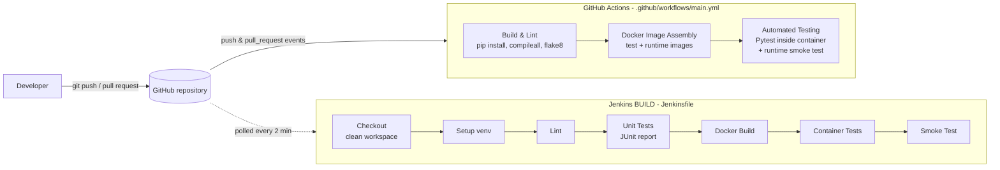

# ACEest Fitness & Gym — Flask App with Automated CI/CD

[](https://github.com/FreyaModi/ACEest-Fitness-CI-CD/actions/workflows/main.yml)


ACEest Fitness & Gym is a Flask web application and REST API for managing a gym's
clients, training programs, workouts, body metrics and memberships. It started as a
Tkinter desktop app (`Aceestver-1.0` to `Aceestver-3.2.4`). This repository rebuilds it
as a modular web service and ships it through a full DevOps workflow:

**Git/GitHub** (version control) → **Pytest** (validation) → **Docker** (containerization)
→ **Jenkins** (BUILD quality gate) → **GitHub Actions** (CI/CD on every push and pull request).

---

## Table of Contents

1. [Features](#features)
2. [Project Structure](#project-structure)
3. [Local Setup and Execution](#local-setup-and-execution)
4. [Running the Tests Manually](#running-the-tests-manually)
5. [Running with Docker](#running-with-docker)
6. [API Reference](#api-reference)
7. [CI/CD Integration Overview](#cicd-integration-overview)
8. [Jenkins BUILD Server](#jenkins-build-server)
9. [GitHub Actions Pipeline](#github-actions-pipeline)
10. [Quality Gate Demonstration](#quality-gate-demonstration)
11. [Version Control Strategy](#version-control-strategy)
12. [Troubleshooting](#troubleshooting)

---

## Features

| Area | What it does | Ported from |
|------|--------------|-------------|
| Training programs | Fat Loss (FL), Muscle Gain (MG) and Beginner (BG) programs, each with a weekly workout, a diet plan and a calorie factor | v1.0, v1.1 |
| Calorie estimate | Daily calories = body weight (kg) × the program's calorie factor | v1.1 |
| Client management | Create, read, update and delete client profiles stored in SQLite. Calories are recalculated automatically | v2.0.1 – v2.2.1 |
| Weekly progress | Log adherence (0–100 %) per week and see weeks logged and the average | v2.x |
| CSV export | Download all clients as a CSV file | v1.1.2 |
| Workouts | Log sessions (type, duration, notes) with nested exercises (sets, reps, weight). Saved in one transaction | v2.2.4, v3.0.1 |
| Body metrics | Log weight, waist and body fat. A weigh-in also updates the profile weight and calorie target | v2.2.4, v3.0.1 |
| BMI and risk | BMI with WHO category and a coaching risk note | v2.2.4 |
| Client summary | Profile, goals (weight to target, adherence on track), progress, latest metrics and BMI in one call | v2.2.4 |
| Program generator | Rule-based weekly plan from the client's program and experience level (beginner/intermediate/advanced). Add a seed for a repeatable plan | v3.1.2 |
| Membership | Effective status (Active / Expired / Inactive), days remaining, a renewal-due flag and renewal by N months | v3.2.4 |
| Dashboard | HTML home page with the programs, registered clients and the API endpoints | — |

Inputs are validated: bad data returns **400**, unknown records **404**,
duplicate clients **409** and the wrong HTTP method **405**. Every error is returned as JSON.

---

## Project Structure

```
.
├── app.py                  # Application factory, dashboard, /health, JSON error handlers
├── api.py                  # REST API blueprint (/api/...): request parsing and responses
├── fitness.py              # Pure domain logic: programs, calories, BMI, generator, membership
├── models.py               # Data-access layer (all SQL lives here)
├── database.py             # SQLite connection handling and the `flask init-db` command
├── validators.py           # Input validation helpers (ValidationError -> HTTP 400)
├── schema.sql              # Idempotent database schema
├── templates/index.html    # Dashboard page
├── requirements.txt        # Runtime dependencies (Flask, gunicorn)
├── requirements-dev.txt    # Test and lint dependencies (pytest, pytest-cov, flake8)
├── tests/                  # Pytest suite (208 tests, 100 % line coverage)
├── Dockerfile              # Multi-stage image: `test` target and slim, non-root `runtime` target
├── .dockerignore
├── Jenkinsfile             # Jenkins BUILD pipeline
├── jenkins/                # A new Jenkins server as code (Docker Compose + JCasC)
│   ├── Dockerfile          # Jenkins LTS + Python 3 + Docker CLI + plugins
│   ├── docker-compose.yml  # Jenkins controller + docker:dind sidecar
│   ├── casc.yaml           # Admin user, security and the pipeline job
│   ├── plugins.txt
│   └── .env.example        # Template for the local secrets file (.env)
└── .github/workflows/main.yml   # GitHub Actions CI/CD pipeline
```

The layers keep business rules testable without Flask or a database:
`api.py` (HTTP) → `fitness.py` (rules) and `models.py` (SQL) → `database.py` (connection).

---

## Local Setup and Execution

**Prerequisites:** Python 3.11+ (3.13 recommended) and Git. Docker is needed only for
the container steps.

```bash
# 1. Clone the repository
git clone https://github.com/FreyaModi/ACEest-Fitness-CI-CD.git
cd ACEest-Fitness-CI-CD

# 2. Create and activate a virtual environment
python3 -m venv .venv
source .venv/bin/activate          # Windows: .venv\Scripts\activate

# 3. Install the dependencies (runtime + test/lint tools)
pip install -r requirements-dev.txt

# 4. Start the development server
python app.py                      # http://localhost:5000
```

The SQLite database is created automatically on start-up at `instance/aceest_fitness.db`.

| Environment variable | Default | Purpose |
|----------------------|---------|---------|
| `ACEEST_DATABASE` | `instance/aceest_fitness.db` | Path of the SQLite database file |
| `PORT` | `5000` | Port of the development server (`python app.py`) |

Other ways to run it:

```bash
PORT=5001 python app.py                                # different port (see Troubleshooting)
flask --app app run --debug                            # Flask dev server with auto-reload
flask --app app init-db                                # create the tables explicitly
gunicorn --bind 0.0.0.0:5000 --workers 2 "app:create_app()"   # production server
```

Quick check:

```bash
curl http://localhost:5000/health
# {"service":"aceest-fitness","status":"ok","version":"3.1.0"}
```

---

## Running the Tests Manually

The test suite lives in `tests/` and covers:

| File | Scope |
|------|-------|
| `test_validators.py` | Number, text and date validation, bounds, edge cases |
| `test_fitness.py` | Programs, calories, BMI categories and boundaries, generator rules, membership dates |
| `test_app.py` | App factory, configuration, `init-db` CLI, dashboard, `/health`, JSON 404/405 |
| `test_api_programs.py` | Program and calorie endpoints |
| `test_api_clients.py` | Client CRUD, validation, conflicts, progress, CSV export, cascading deletes |
| `test_api_tracking.py` | BMI, workouts with exercises, transaction rollback, metrics, summary |
| `test_api_programs_membership.py` | Program generator and membership endpoints |

Each test gets its own temporary SQLite database, so tests are isolated and repeatable.

```bash
source .venv/bin/activate

pytest                                   # run the whole suite
pytest -v                                # verbose: one line per test
pytest tests/test_fitness.py             # a single file
pytest -k membership                     # tests whose name matches "membership"
pytest --cov --cov-report=term-missing   # with a line-coverage report
pytest --cov --cov-report=html           # HTML coverage report in htmlcov/

flake8 .                                 # lint (style and syntax)
python -m compileall -q -x '/\.(git|venv)/' .   # byte-compile everything (syntax check)
```

Run the same suite **inside the container**, exactly as the pipelines do:

```bash
docker build --target test -t aceest-fitness:test .
docker run --rm aceest-fitness:test
```

---

## Running with Docker

The `Dockerfile` is a multi-stage build:

| Stage | Purpose |
|-------|---------|
| `base` | `python:3.13-slim`, no `.pyc` files, unbuffered logs, no pip cache |
| `builder` | Installs runtime dependencies into `/opt/venv` |
| `test` | Adds dev dependencies and the tests. Its default command runs Pytest |
| `runtime` (default) | Copies only the venv and the app code; runs gunicorn |

Size and security measures in the runtime image:

- Slim base image. Build tools, tests and dev dependencies are left out (about 170 MB in total).
- Runs as an **unprivileged user** (`aceest`, uid 10001). The application code is
  owned by root, so the process cannot modify it.
- `.dockerignore` keeps `.git`, virtualenvs, local databases and `.env` files out of the build context.
- A `HEALTHCHECK` calls `/health`. The SQLite data lives in a `/data` volume.

```bash
docker build -t aceest-fitness:latest .
docker run -d --name aceest -p 5000:5000 -v aceest-data:/data aceest-fitness:latest
docker ps                       # STATUS shows "(healthy)" after a few seconds
curl http://localhost:5000/health
docker logs aceest
docker rm -f aceest             # stop and remove (data stays in the aceest-data volume)
```

---

## API Reference

Base URL: `http://localhost:5000`. Request and response bodies are JSON.
`<name>` is the client's name, matched case-insensitively (URL-encode spaces as `%20`).

| Method | Path | Description |
|--------|------|-------------|
| GET | `/` | HTML dashboard |
| GET | `/health` | Health check (`status`, `service`, `version`) |
| GET | `/api/programs` | List the training programs |
| GET | `/api/programs/<code>` | One program (`FL`, `MG`, `BG`) |
| POST | `/api/calories` | `{"weight": 70, "program": "FL"}` → daily calories |
| POST | `/api/bmi` | `{"height": 175, "weight": 70}` → BMI, category, risk |
| POST | `/api/programs/generate` | `{"experience": "beginner", "program": "MG", "seed": 1}` → weekly plan |
| GET | `/api/clients` | List clients |
| POST | `/api/clients` | Create a client (only `name` is required) |
| GET | `/api/clients/<name>` | Get a client |
| PATCH | `/api/clients/<name>` | Partial update. Calories are recalculated |
| DELETE | `/api/clients/<name>` | Delete a client and all of their data |
| GET/POST | `/api/clients/<name>/progress` | Weekly adherence log and summary |
| GET/POST | `/api/clients/<name>/workouts` | Workout sessions with exercises |
| GET/POST | `/api/clients/<name>/metrics` | Body metrics (weight, waist, body fat) |
| GET | `/api/clients/<name>/bmi` | BMI from the stored height and weight |
| GET | `/api/clients/<name>/summary` | Profile, program, goals, progress, latest metrics and BMI |
| POST | `/api/clients/<name>/generate-program` | `{"experience": "advanced"}` → plan for the client's program |
| GET | `/api/clients/<name>/membership` | Membership status, days remaining, renewal due |
| POST | `/api/clients/<name>/membership/renew` | `{"months": 6}` → extend and reactivate the membership |
| GET | `/api/export/clients.csv` | Download all clients as CSV |

Client fields: `name`, `age` (1–120), `height` (cm), `weight` (kg), `program`
(`FL`/`MG`/`BG` or the full name), `target_weight`, `target_adherence` (0–100),
`membership_status` (`Active`/`Inactive`) and `membership_end` (`YYYY-MM-DD`).
`calories` is calculated by the server.

Example session:

```bash
curl -X POST localhost:5000/api/clients -H 'Content-Type: application/json' \
     -d '{"name": "Arjun", "age": 28, "height": 175, "weight": 85, "program": "FL",
          "target_weight": 75, "target_adherence": 80, "membership_end": "2026-12-31"}'
# -> 201 {"name": "Arjun", "calories": 1870, ...}

curl -X POST localhost:5000/api/clients/Arjun/progress -H 'Content-Type: application/json' \
     -d '{"adherence": 88}'

curl -X POST localhost:5000/api/clients/Arjun/workouts -H 'Content-Type: application/json' \
     -d '{"workout_type": "Strength", "duration_min": 60,
          "exercises": [{"name": "Back Squat", "sets": 5, "reps": 5, "weight": 100}]}'

curl localhost:5000/api/clients/Arjun/summary
curl -X POST localhost:5000/api/clients/Arjun/generate-program -H 'Content-Type: application/json' \
     -d '{"experience": "intermediate"}'
```

---

## CI/CD Integration Overview

Two independent pipelines check every change. Both build from the same source,
`Dockerfile` and test suite, so a green result means the same thing in each.



| | GitHub Actions | Jenkins |
|---|---|---|
| Role | CI/CD gate on **every push and pull request** (all branches) | Controlled BUILD environment and **secondary quality gate** for `main` |
| Trigger | `push`, `pull_request`, manual `workflow_dispatch` | SCM polling every 2 minutes, plus manual "Build Now" |
| Runs on | GitHub-hosted Ubuntu runners | A new, dedicated Jenkins LTS server (Docker) |
| Stages | Build & Lint → Docker Image Assembly → Automated Testing | Checkout → Setup → Lint → Unit Tests → Docker Build → Container Tests → Smoke Test |
| Reports | JUnit and coverage XML uploaded as artifacts | JUnit trend in the Jenkins UI, archived reports |
| Configuration | `.github/workflows/main.yml` | `Jenkinsfile` + `jenkins/` (server as code) |

How they work together:

1. A developer pushes a feature branch or opens a pull request. **GitHub Actions** runs
   lint, builds the image and runs the tests inside it. The pull request shows the result
   before anything is merged.
2. After the merge to `main`, **Jenkins** finds the new commit (polling), pulls the latest
   code into a **clean workspace** and builds everything again from scratch on its own
   infrastructure. This second check confirms the code builds and integrates outside GitHub's runners.
3. A failure in any stage stops that pipeline and marks the build red.

---

## Jenkins BUILD Server

`jenkins/` sets up a **new, self-contained Jenkins server** with Docker Compose. It is
fully configured as code, so no manual clicks are needed:

- **`jenkins/Dockerfile`**: Jenkins LTS (2.580.1, JDK 21) plus Python 3 (for lint and
  unit tests), the Docker CLI with buildx, and the plugins in `plugins.txt` (Pipeline,
  Git, JCasC, Job DSL, JUnit, Workspace Cleanup, Timestamper, Stage View).
- **`jenkins/docker-compose.yml`**: the Jenkins controller and a `docker:dind`
  sidecar. Pipeline `docker build` and `docker run` commands go to the sidecar over TLS,
  so builds never touch the host's Docker engine.
- **`jenkins/casc.yaml`** (Jenkins Configuration as Code) skips the setup wizard,
  creates the admin user, disables sign-up and anonymous access, and creates the
  pipeline job **`aceest-fitness-build`** with Job DSL. The job uses the `Jenkinsfile`
  from the repository and polls GitHub every 2 minutes.

### Start the server

```bash
cd jenkins
cp .env.example .env      # set JENKINS_ADMIN_PASSWORD and GITHUB_REPO_URL
docker compose up -d --build
```

Open <http://localhost:8080> and sign in with the credentials from `jenkins/.env`.
The **ACEest Fitness - BUILD** job is already there. The first poll starts a build
automatically, or you can click **Build Now**.

```bash
docker compose logs -f jenkins   # follow the Jenkins logs
docker compose down              # stop (job history is kept in the jenkins-data volume)
docker compose down -v           # stop and delete all Jenkins data
```

> **Why polling instead of webhooks?** This Jenkins runs on a local machine that GitHub
> cannot reach. `pollSCM('H/2 * * * *')` checks the repository every 2 minutes and
> builds only when there is a new commit. If Jenkins is hosted publicly, add a GitHub
> webhook (`/github-webhook/`) to trigger builds instantly.

### Pipeline stages (`Jenkinsfile`)

| Stage | What happens |
|-------|--------------|
| Checkout | Wipes the workspace (`cleanWs`) and checks out the latest commit from GitHub |
| Setup Environment | Creates a fresh virtualenv and installs `requirements-dev.txt` |
| Lint | `compileall` syntax check and `flake8` |
| Unit Tests | Pytest with coverage. JUnit results are published to Jenkins |
| Docker Build | Builds the `test` and `runtime` images, tagged with the build number |
| Container Tests | Runs the Pytest suite inside the `test` image |
| Smoke Test | Starts the runtime image, waits for its HEALTHCHECK to report `healthy`, then calls `/health` |
| Post | Archives reports and container logs, removes temporary containers/images, cleans the workspace |

---

## GitHub Actions Pipeline

`.github/workflows/main.yml` runs on **every `push` and `pull_request`** on any branch, and can also be started manually.
It has three jobs that depend on each other:

1. **Build & Lint** installs the dependencies with pip caching, byte-compiles all sources
   (`compileall`), runs `flake8` and checks that the app factory starts.
2. **Docker Image Assembly** builds the `test` and `runtime` images and passes them to
   the next job as an artifact.
3. **Automated Testing (in container)** loads the images, runs the **Pytest suite inside
   the test container** (JUnit and coverage XML uploaded as `test-reports`), then starts
   the runtime container and checks its HEALTHCHECK and live API responses.

The workflow has read-only repository permissions. A newer push to the same branch
cancels the run that is still in progress.

---

## Quality Gate Demonstration

To prove the pipelines really stop bad changes, the branch
[`demo/quality-gate`](https://github.com/FreyaModi/ACEest-Fitness-CI-CD/tree/demo/quality-gate)
contains **deliberately broken commits**, each labelled `INTENTIONAL FAILURE`, followed by
the fixes. Every commit was pushed on its own, so each one got its own GitHub Actions run
(on the push and on [pull request #1](https://github.com/FreyaModi/ACEest-Fitness-CI-CD/pull/1))
and its own build in the Jenkins job **ACEest Fitness - Quality Gate Demo**, which builds
that branch.

| Push | Change | Jenkins result | GitHub Actions result |
|------|--------|----------------|-----------------------|
| 1 | Unused import (flake8 `F401`) | ❌ Fails at **Lint** | ❌ Fails at **Build & Lint** |
| 2 | Fat Loss calorie factor changed from 22 to 20 | ❌ Lint passes, fails at **Unit Tests** (6 tests) | ❌ Fails at **Automated Testing (in container)** |
| 3 | Dockerfile copies a file that doesn't exist | ❌ Tests pass, fails at **Docker Build** | ❌ Fails at **Docker Image Assembly** |
| 4 | Revert the last breakage | ✅ Success | ✅ Success |
| 5 | This README section | ✅ Success | ✅ Success |

Each failure is caught by a later stage than the one before, which shows that every
stage is a real gate. Each breakage is reverted by the next commit, so `main` is never broken.

---

## Version Control Strategy

- **`main`** is always releasable. Work happens on short-lived branches named by intent:
  `feature/*` (application features), `infra/*` (Docker), `ci/*` (pipelines),
  `fix/*` (bug fixes) and `docs/*` (documentation).
- Branches merge into `main` with `--no-ff` merge commits, so the history shows each
  feature as one unit.
- Commits follow [Conventional Commits](https://www.conventionalcommits.org/)
  (`feat:`, `fix:`, `test:`, `build:`, `ci:`, `docs:`, `chore:`). Each message says what
  changed and why.
- Each milestone has an annotated tag that follows the legacy versions:

| Tag | Milestone | Legacy source |
|-----|-----------|---------------|
| `v1.0.0` | Flask app, training programs, calorie API | Aceestver-1.0, 1.1 |
| `v2.0.0` | SQLite persistence, client CRUD, progress, CSV export | Aceestver-1.1.2, 2.0.1 – 2.2.1 |
| `v2.1.0` | Workouts, body metrics, BMI, client summary | Aceestver-2.2.4, 3.0.1 |
| `v3.0.0` | Program generator, membership tracking | Aceestver-3.1.2, 3.2.4 |
| `v3.1.0` | Docker, GitHub Actions, Jenkins, documentation | — |

```bash
git log --oneline --graph --all   # view the branch and merge history
git tag -n                        # list the release tags
```

---

## Troubleshooting

| Problem | Fix |
|---------|-----|
| `Address already in use` on port 5000 (macOS) | AirPlay Receiver uses port 5000. Run `PORT=5001 python app.py` or map another port: `docker run -p 5001:5000 ...` |
| `ModuleNotFoundError: flask` | Activate the virtualenv (`source .venv/bin/activate`) and run `pip install -r requirements-dev.txt` |
| Jenkins port 8080 is busy | Set `JENKINS_PORT=8081` in `jenkins/.env` and run `docker compose up -d` again |
| Jenkins build cannot reach Docker | Check that the sidecar is running: `docker compose ps` should show `aceest-jenkins-docker` |
| Want a fresh database | Delete `instance/aceest_fitness.db`, or the `aceest-data` volume for Docker |
